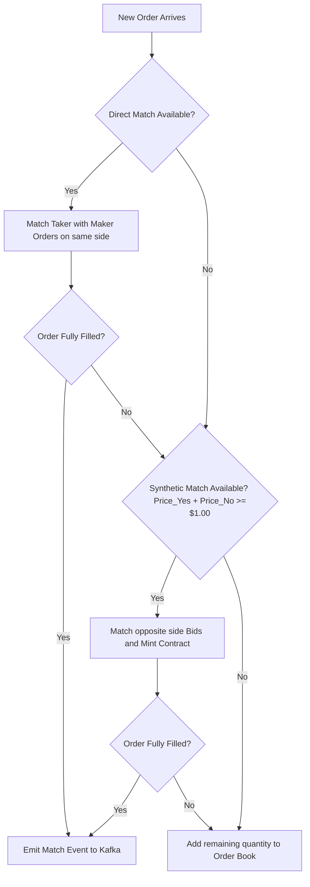

# Central Limit Order Book (CLOB) Implementation Plan

This document outlines the concrete technical specification, data structures, algorithms, and integration architecture for implementing a high-performance, low-latency **Central Limit Order Book (CLOB)** matching engine for our prediction market platform.

---

## 1. System Requirements & Goals

* **Throughput:** Process $\ge 10,000$ order operations (inserts, cancels, matches) per second.
* **Latency:** Low matching latency ($<1$ millisecond at $p99$ in-memory).
* **Price Range:** Strict bounds of $\$0.01$ to $\$0.99$ per share (bids and asks).
* **Contract Integrity:** Maintain the mathematical invariant:
  $$\text{Price}(\text{YES}) + \text{Price}(\text{NO}) = \$1.00$$
* **Synthetic Matching (Shared Liquidity):** Support **Contract Minting** and **Contract Burning** to automatically link the YES and NO order books, eliminating arbitrage gaps and maximizing liquidity efficiency.

---

## 2. Structural & Language Tradeoffs (Go vs. Rust vs. Python)

We evaluated three development stacks for the core matching engine:

| Metric | Python (AsyncIO) | Go (Golang) | Rust |
| :--- | :--- | :--- | :--- |
| **Execution Speed** | Slow ($500\mu s - 2\text{ms}$ per match) | Extremely Fast ($10-50\mu s$ per match) | Absolute Fast ($2-5\mu s$ per match) |
| **Concurrency Model** | Single-threaded Event Loop | Goroutines & Channels (M:N scheduler) | POSIX Threads / Tokio Async |
| **Memory Safety** | Garbage Collected | GC (low-overhead, optimized) | Manual/Compile-time (no GC) |
| **Development Velocity** | High | Very High (Simple syntax, native tooling) | Medium (High learning curve) |
| **Recommendation** | ❌ Unsuitable for high-frequency | **Selected (Optimal balance of speed & velocity)** | 💡 Backup choice for extreme optimization |

**Decision:** We select **Go (Golang)**. Go's native support for channels and lightweight concurrency structures (Goroutines) makes it uniquely suited for scaling network and WebSocket operations, while its garbage collector is sufficiently optimized to prevent matching jitter under heavy loads.

---

## 3. High-Performance In-Memory Data Structures

To achieve sub-millisecond execution, the matching engine maintains the active order books entirely in memory. 

### 3.1 The 99-Price-Bucket Optimization
Traditional equity matching engines use balanced binary search trees (e.g. Red-Black trees) or B-trees to sort orders by price, resulting in $O(\log N)$ operations. 

Because prediction market shares are restricted to **discrete cents from $\$0.01$ to $\$0.99$**, we can optimize this to **$O(1)$ operations** using a static **Price Bucket Array** of size 100.

```
OrderBook (YES)
+-----------------------------+
| Bids [100]PriceBucket       | --> [0.58] -> [Order1] <-> [Order2] <-> [Order3] (FIFO Doubly Linked List)
|                             | --> [0.57] -> [Order4] <-> [Order5]
+-----------------------------+
| Asks [100]PriceBucket       | --> [0.60] -> [Order6] <-> [Order7]
|                             | --> [0.61] -> [Order8]
+-----------------------------+
```

### 3.2 Struct Definitions (Go)

```go
package clob

import (
	"sync"
	"time"
)

// OrderSide represents buy or sell
type OrderSide string
const (
	Buy  OrderSide = "buy"
	Sell OrderSide = "sell"
)

// OutcomeSide represents yes or no
type OutcomeSide string
const (
	Yes OutcomeSide = "yes"
	No  OutcomeSide = "no"
)

// Order represents an active limit or market order
type Order struct {
	ID             string      `json:"id"`
	MarketID       string      `json:"market_id"`
	UserID         string      `json:"user_id"`
	Side           OrderSide   `json:"side"`
	Outcome        OutcomeSide `json:"outcome"`
	Price          int64       `json:"price"` // Represented in cents: 1 to 99
	Quantity       int64       `json:"quantity"`
	FilledQuantity int64       `json:"filled_quantity"`
	CreatedAt      time.Time   `json:"created_at"`
	
	// Pointers for fast O(1) doubly linked list node operations
	Next *Order `json:"-"`
	Prev *Order `json:"-"`
}

// PriceBucket is a FIFO queue of orders at a specific price level
type PriceBucket struct {
	Price int64  // Price in cents (1-99)
	Head  *Order
	Tail  *Order
	Volume int64 // Total shares remaining at this price
}

func (pb *PriceBucket) Append(order *Order) {
	if pb.Head == nil {
		pb.Head = order
		pb.Tail = order
	} else {
		pb.Tail.Next = order
		order.Prev = pb.Tail
		pb.Tail = order
	}
	pb.Volume += (order.Quantity - order.FilledQuantity)
}

func (pb *PriceBucket) RemoveHead() *Order {
	if pb.Head == nil {
		return nil
	}
	removed := pb.Head
	pb.Head = pb.Head.Next
	if pb.Head != nil {
		pb.Head.Prev = nil
	} else {
		pb.Tail = nil
	}
	removed.Next = nil
	removed.Prev = nil
	pb.Volume -= (removed.Quantity - removed.FilledQuantity)
	return removed
}

// MarketBook represents the active book for a single market id
type MarketBook struct {
	sync.RWMutex
	MarketID string
	
	// Arrays of size 100 for fast index access
	YesBids [100]*PriceBucket
	YesAsks [100]*PriceBucket
	NoBids  [100]*PriceBucket
	NoAsks  [100]*PriceBucket
}

// GlobalEngine holds all market books
type GlobalEngine struct {
	sync.RWMutex
	Books map[string]*MarketBook
}
```

---

## 4. The Matching & Contract-Minting Algorithm

When a new order (Taker Order) enters the engine, it goes through two sequential matching loops: **Direct Matching** and **Synthetic Matching**.



### 4.1 Match Types Explained
1. **Direct Match (Standard Equity Matching):**
   * A YES BUY matches with a YES SELL.
   * *Settlement:* Cash changes hands. The YES buyer pays the YES seller, and YES shares are transferred.
2. **Synthetic Match (Contract Minting):**
   * A YES BUY at $\$0.58$ matches with a NO BUY at $\$0.43$.
   * *Settlement:* The sum of their bid prices is $\$0.58 + \$0.43 = \$1.01 \ge \$1.00$. The platform takes exactly $\$0.58$ from the YES buyer, $\$0.42$ from the NO buyer (refunding $\$0.01$ to the NO buyer). It pools this $\$1.00$ to **mint a brand new contract** (1 YES share + 1 NO share) and distributes the YES share to the YES buyer and the NO share to the NO buyer.
3. **Synthetic Match (Contract Burning):**
   * A YES SELL at $\$0.58$ matches with a NO SELL at $\$0.42$.
   * *Settlement:* A buyer can purchase both shares for exactly $\$1.00$. If these sell orders match against each other, the sellers are **burning their combined inventory** (1 YES share + 1 NO share) to release the underlying $\$1.00$ cash collateral locked in the database back to their balances.

### 4.2 Core Matching Algorithm Logic (Pseudocode)

```go
func MatchOrder(book *MarketBook, taker *Order) []*Trade {
	var trades []*Trade
	
	// 1. Direct Matching Loop
	if taker.Side == Buy {
		// If buying YES, look at YES ASKs from $0.01 up to taker.Price
		asks := getActiveAsks(book, taker.Outcome)
		for price := int64(1); price <= taker.Price; price++ {
			bucket := asks[price]
			if bucket == nil || bucket.Head == nil {
				continue
			}
			
			for bucket.Head != nil && taker.Quantity > taker.FilledQuantity {
				maker := bucket.Head
				matchQty := min(taker.Quantity - taker.FilledQuantity, maker.Quantity - maker.FilledQuantity)
				
				// Execute Match
				taker.FilledQuantity += matchQty
				maker.FilledQuantity += matchQty
				bucket.Volume -= matchQty
				
				trades = append(trades, NewTrade(book.MarketID, taker, maker, matchQty, maker.Price))
				
				if maker.Quantity == maker.FilledQuantity {
					bucket.RemoveHead()
				}
			}
		}
	} else {
		// Sell order: look at Bids from $0.99 down to taker.Price
		bids := getActiveBids(book, taker.Outcome)
		for price := int64(99); price >= taker.Price; price-- {
			bucket := bids[price]
			if bucket == nil || bucket.Head == nil {
				continue
			}
			
			for bucket.Head != nil && taker.Quantity > taker.FilledQuantity {
				maker := bucket.Head
				matchQty := min(taker.Quantity - taker.FilledQuantity, maker.Quantity - maker.FilledQuantity)
				
				taker.FilledQuantity += matchQty
				maker.FilledQuantity += matchQty
				bucket.Volume -= matchQty
				
				trades = append(trades, NewTrade(book.MarketID, maker, taker, matchQty, maker.Price))
				
				if maker.Quantity == maker.FilledQuantity {
					bucket.RemoveHead()
				}
			}
		}
	}
	
	// If order is fully filled, exit
	if taker.Quantity == taker.FilledQuantity {
		return trades
	}
	
	// 2. Synthetic Matching Loop (Contract Minting)
	// ONLY runs if the taker order is a BUY order
	if taker.Side == Buy {
		oppositeOutcome := getOppositeOutcome(taker.Outcome)
		oppositeBids := getActiveBids(book, oppositeOutcome)
		
		// We need Taker.Price + Maker.Price >= 100 (which is $1.00)
		// Therefore, Maker.Price must be >= 100 - Taker.Price
		minOppositePrice := 100 - taker.Price
		
		for price := int64(99); price >= minOppositePrice; price-- {
			bucket := oppositeBids[price]
			if bucket == nil || bucket.Head == nil {
				continue
			}
			
			for bucket.Head != nil && taker.Quantity > taker.FilledQuantity {
				maker := bucket.Head
				matchQty := min(taker.Quantity - taker.FilledQuantity, maker.Quantity - maker.FilledQuantity)
				
				// Execute Match and Mint Contract
				taker.FilledQuantity += matchQty
				maker.FilledQuantity += matchQty
				bucket.Volume -= matchQty
				
				// Set exact clearing prices summing to exactly 100 cents
				// Taker gets filled at its bid, maker gets filled at its bid, excess is refunded or platform fee
				trades = append(trades, NewSyntheticMintTrade(book.MarketID, taker, maker, matchQty))
				
				if maker.Quantity == maker.FilledQuantity {
					bucket.RemoveHead()
				}
			}
		}
	}
	
	// 3. Post to Book if not fully filled
	if taker.Quantity > taker.FilledQuantity {
		addToBook(book, taker)
	}
	
	return trades
}
```

---

## 5. Pipeline Architecture & Event Settlement

Because writing to a disk-based database is slow (often $10-50\text{ms}$ per transaction), the matching thread **never writes directly to PostgreSQL**. Doing so would block the matching loop and trigger huge lag.

We decouple matching, persistence, and notifications using an asynchronous **Event-Driven Architecture**:

```
                         +------------------------+
                         |      Kafka Broker      |
                         +-----------+------------+
                                     |
                                     | (Consumes Order Operations)
                                     v
                        +--------------------------+
                        |  Matching Engine (Go)    | <--- Holds Active State In-Memory
                        +------------+-------------+
                                     |
                                     | (Publishes Matched Trades & Book Updates)
                                     v
                         +------------------------+
                         |      Kafka Broker      |
                         +-----+------------+-----+
                               |            |
             +-----------------+            +-----------------+
             |                                                |
             v                                                v
+--------------------------+                     +--------------------------+
| PostgreSQL Writer (Go)   |                     | WebSocket Broadcaster(Go)|
+------------+-------------+                     +------------+-------------+
             |                                                |
             v (Batch Writes in Transaction)                  v (Broadcasts L2 book depth)
    [(PostgreSQL DB)]                                     [Client UI]
```

### 5.1 Pipeline Steps:
1. **Order Placement:** Client posts order to API. The API service verifies user balance, locks the required balance margin locally, and publishes an `OrderPlacementEvent` to the Kafka topic `pending-orders`.
2. **Matching:** The `Matching Engine` consumes `pending-orders` sequentially, runs the in-memory matching algorithm, and outputs results to two channels:
   * Channels/PubSub: Emits L2/L3 order depth to Redis for immediate WebSockets push to users.
   * Kafka Topic `matched-trades`: Emits trade details and balance updates.
3. **Database Persistence:** A Go-based `Settlement Worker` consumes `matched-trades`, compiles matches into batches of 100, and performs a bulk transaction write to PostgreSQL:
   ```sql
   -- Deduct buyer balances, credit seller balances, insert trades, update order statuses
   ```

---

## 6. Concurrency & Mutex Optimization

In-memory data structures are highly susceptible to race conditions. To prevent data corruption, we implement a **Siloed Channel Architecture** instead of global locks:

* **No Global Mutexes:** Each `MarketBook` has its own isolated read-write mutex (`sync.RWMutex`). Modifying orders in Market A does not lock or block orders in Market B.
* **Actor Model Partitioning:**
  * Go channels are set up to handle individual markets.
  * For each market, a dedicated Goroutine acts as the "Market Actor". It is the *only* thread allowed to read or write to that specific `MarketBook` memory.
  * All incoming orders for that market are sent to a dedicated channel `chan *Order`.
  * This eliminates lock contention entirely! The engine runs lock-free since matching runs single-threaded *per market*, utilizing multiple CPU cores naturally across thousands of active markets.

---

## 7. Testing & Verification Matrix

To ensure absolute math and financial system integrity, we will build a dedicated verification test suite:

### 7.1 Automated Invariance Tests
* **Balance Sum Test:** Create 1,000 random orders in a simulated book. Run matching. Verify that:
  $$\sum \text{User Balances} + \sum \text{Locked Margins} = \text{Initial Cash Supply}$$
* **Direct Match Spread Test:** Assert that a BUY order at $\$0.60$ and an ASK order at $\$0.55$ clear at $\$0.55$ (maker price) rather than leaving spread gaps.
* **Synthetic Spread Bound Test:** Assert that synthetic matching is *only* triggered when the combined bids sum to $\ge \$1.00$. Assert that a combination summing to $\$0.99$ remains open as bids in their respective books.

### 7.2 Stress & Latency Benchmarks
* Run `go test -bench` to evaluate CPU time per trade execution. Goal is $<20\mu s$ per matching operation in Go.
* Simulate 100,000 orders across 10 parallel threads to stress-test mutex contention and garbage collector sweeps, verifying latency profiles do not exceed $100\text{ms}$ during memory compaction sweeps.

---

## 8. Implementation Steps & Milestones

1. **Sprint 1 (Go Structures & Doubly Linked List):** Write core Go modules for `Order`, `PriceBucket`, and `MarketBook` with unit tests verifying append/remove operations ($O(1)$ verification).
2. **Sprint 2 (Direct Matching Logic):** Implement FIFO matching loop for BUY and SELL orders on the same outcome.
3. **Sprint 3 (Synthetic Minting & Burning Logic):** Implement cross-outcome matching mathematics (YES buy + NO buy $\ge \$1.00$).
4. **Sprint 4 (Kafka Event Pipelines & Postgres Batches):** Write Go wrapper to consume/publish Kafka events, and the Postgres batch writer.
5. **Sprint 5 (Stress Testing & Performance Tuning):** Run load benchmark tests, audit memory leaks, and profile locks.
