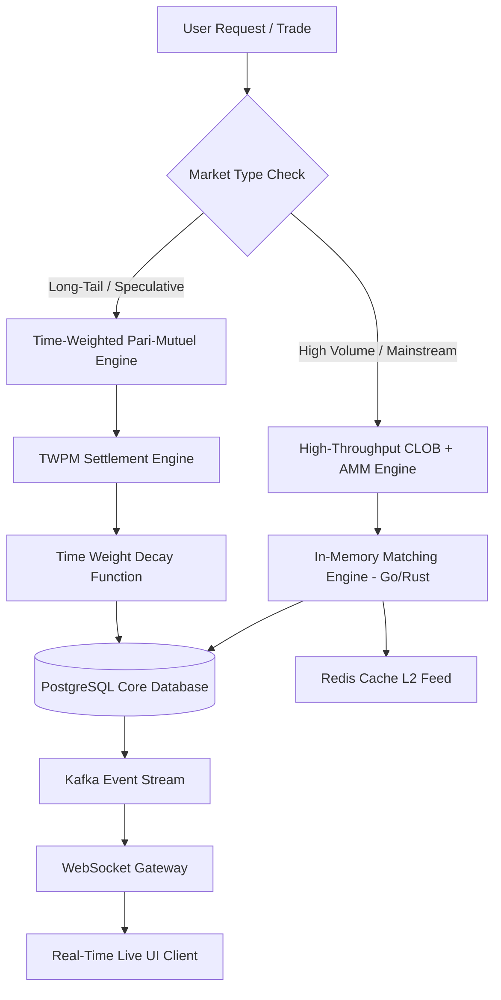
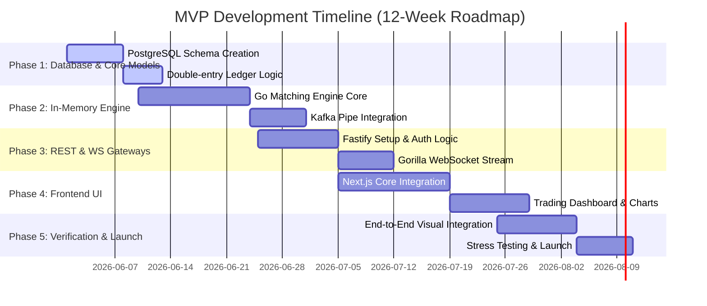

# Platform Architecture & Product Specification: A Hybrid Venture-Scale Prediction Market

This document outlines the strategic vision, architectural design, database schemas, and engineering implementation roadmap for a next-generation, high-performance prediction market platform. 

The platform is designed to support a hybrid model: a high-throughput **Central Limit Order Book (CLOB)** and **Automated Market Maker (AMM)** for mainstream high-frequency markets, integrated with a **Time-Weighted Pari-Mutuel (TWPM)** engine (inherited and scaled from the existing prototype) to enable instant liquidity in long-tail, user-generated markets.

---

## 1. Executive Summary & Strategic Vision

Modern prediction markets (e.g., Polymarket, Kalshi) have proved the massive global demand for information-aggregating platforms. However, they face two systemic bottlenecks:
1. **The Liquidity Cold-Start Problem:** Standard Order Books (CLOBs) require professional market makers (MMs) and substantial capital to maintain tight spreads in long-tail markets. Consequently, 90% of user-created markets suffer from empty order books.
2. **Information Asymmetry:** In the final hours before a market resolves, insiders or high-frequency scrapers front-run general users because late-stage probability trading represents a near-certain bet.

### The Hybrid Solution
Our platform solves these bottlenecks through a dual-engine architecture:



1. **Mainstream Markets Engine (CLOB + AMM):** Uses an in-memory double-auction matching engine with a constant product AMM serving as the liquidity provider of last resort. Excellent for high-volume politics, macroeconomic indicators, and major sports.
2. **Long-Tail Markets Engine (TWPM):** Retains the mathematical framework of the current prototype. By applying a square-root time decay weight on bets, it enables zero-capital cold-starts (anyone can place a bet, and the pool itself constitutes the market) and mathematically offsets late-stage information advantages.

---

## 2. Product Architecture & Market Mechanics

### 2.1 The Time-Weighted Pari-Mutuel (TWPM) Formulation
To support long-tail markets without external liquidity providers, the platform implements a modernized version of the inherited TWPM pool mechanism:

* **Time-Weight Decelerator ($w$):**
  $$w = 1 + k \cdot \left(\frac{T_{resolution} - T_{placed}}{T_{resolution} - T_{start}}\right)^\alpha$$
  * *Parameters:* $k = 2.0$, $\alpha = 0.5$ (Square root weight decay).
  * *UX Impact:* Bets placed at the start of a 10-day market receive a weight of $3.0$, while bets placed in the final hours receive a weight near $1.0$. This creates a strong financial incentive for early price discovery.

* **Capital Cost & Allocation:**
  * User pays cash: $\text{Premium} = \text{shares} \cdot \text{price}$.
  * User's share value is time-weighted: $\text{Weighted Bet}_i = \text{shares} \cdot \text{price} \cdot w_i$.
  * Both unweighted pools ($\text{Total Pool}$) and weighted side-pools ($\text{Weighted Pool}_{\text{Yes}}$, $\text{Weighted Pool}_{\text{No}}$) are tracked in the database.

* **Settlement Formula:**
  Upon resolution by the oracle to side $S \in \{\text{Yes}, \text{No}\}$, the payout for a winning user $i$ is:
  $$\text{Payout}_i = \left( \frac{\text{Weighted Bet}_{i, S}}{\text{Weighted Pool}_S} \right) \cdot \text{Total Pool}$$

### 2.2 CLOB vs. AMM vs. TWPM: Technical & Economic Tradeoffs

| Metric | Central Limit Order Book (CLOB) | Automated Market Maker (AMM) | Time-Weighted Pari-Mutuel (TWPM) |
| :--- | :--- | :--- | :--- |
| **Execution Latency** | Sub-millisecond (In-memory) | Low (Pool math, 10-50ms) | Low (Write-to-pool, 10-20ms) |
| **Capital Efficiency** | High (Requires MMs) | Low (Capital locked in pools) | Infinite (Self-contained, no MMs) |
| **Price Predictability** | Absolute (Instant fill at price) | Predictable (Includes slippage) | Variable (Settled at resolution) |
| **Best Used For** | High-volume, highly active markets | Medium-volume, continuous trading | Long-tail, custom user-generated |
| **Risk profile** | Order book manipulation | Impermanent loss for LPs | Oracle resolution exploits |

---

## 3. Database Modeling (PostgreSQL Schemas)

To scale to millions of users, we move away from SQLite to a highly structured PostgreSQL instance utilizing row partitioning, native UUIDs, fractional numeric scales for financial values (never float/real), and robust indexes.

```sql
-- Core Extensions
CREATE EXTENSION IF NOT EXISTS "uuid-ossp";

-- 1. Users Table
CREATE TABLE users (
    id UUID PRIMARY KEY DEFAULT uuid_generate_v4(),
    username VARCHAR(50) NOT NULL UNIQUE,
    email VARCHAR(255) NOT NULL UNIQUE,
    password_hash VARCHAR(255) NOT NULL,
    avatar_url TEXT,
    reputation_score INT NOT NULL DEFAULT 100,
    kyc_status VARCHAR(20) NOT NULL DEFAULT 'unverified' CHECK (kyc_status IN ('unverified', 'pending', 'verified', 'flagged')),
    created_at TIMESTAMP WITH TIME ZONE DEFAULT CURRENT_TIMESTAMP NOT NULL,
    updated_at TIMESTAMP WITH TIME ZONE DEFAULT CURRENT_TIMESTAMP NOT NULL
);

-- 2. User Balances & Ledger (Double-Entry Bookkeeping)
CREATE TABLE user_balances (
    user_id UUID PRIMARY KEY REFERENCES users(id) ON DELETE RESTRICT,
    available_balance NUMERIC(20, 6) NOT NULL DEFAULT 0.000000 CHECK (available_balance >= 0),
    locked_balance NUMERIC(20, 6) NOT NULL DEFAULT 0.000000 CHECK (locked_balance >= 0), -- Margin/Open Orders
    updated_at TIMESTAMP WITH TIME ZONE DEFAULT CURRENT_TIMESTAMP NOT NULL
);

-- Ledger for audit-trail
CREATE TABLE ledger_transactions (
    id UUID PRIMARY KEY DEFAULT uuid_generate_v4(),
    user_id UUID NOT NULL REFERENCES users(id),
    amount NUMERIC(20, 6) NOT NULL,
    type VARCHAR(30) NOT NULL CHECK (type IN ('deposit', 'withdrawal', 'trade_debit', 'trade_credit', 'payout', 'fee')),
    reference_id UUID, -- Links to orders, bets, or deposit tables
    created_at TIMESTAMP WITH TIME ZONE DEFAULT CURRENT_TIMESTAMP NOT NULL
);
CREATE INDEX idx_ledger_user_created ON ledger_transactions(user_id, created_at DESC);

-- 3. Markets Table (Handles both CLOB/AMM and TWPM engines)
CREATE TABLE markets (
    id UUID PRIMARY KEY DEFAULT uuid_generate_v4(),
    title VARCHAR(255) NOT NULL,
    description TEXT,
    slug VARCHAR(255) NOT NULL UNIQUE,
    category VARCHAR(50) NOT NULL,
    engine_type VARCHAR(10) NOT NULL CHECK (engine_type IN ('clob', 'amm', 'twpm')),
    status VARCHAR(20) NOT NULL DEFAULT 'draft' CHECK (status IN ('draft', 'open', 'paused', 'resolved', 'cancelled')),
    
    -- Timing
    started_at TIMESTAMP WITH TIME ZONE DEFAULT CURRENT_TIMESTAMP NOT NULL,
    estimated_resolution_time TIMESTAMP WITH TIME ZONE NOT NULL,
    resolved_at TIMESTAMP WITH TIME ZONE,
    
    -- Resolution Outcomes
    resolution_source VARCHAR(255) NOT NULL, -- News link, API oracle, etc.
    resolution_side VARCHAR(10) CHECK (resolution_side IN ('yes', 'no') OR resolution_side IS NULL),
    
    -- TWPM Engine Specific Pools (Stored in numeric scale to prevent IEEE-754 precision issues)
    pool_yes NUMERIC(20, 6) NOT NULL DEFAULT 0.000000,
    pool_no NUMERIC(20, 6) NOT NULL DEFAULT 0.000000,
    tot_pool NUMERIC(20, 6) NOT NULL DEFAULT 0.000000,
    weighted_pool_yes NUMERIC(20, 6) NOT NULL DEFAULT 0.000000,
    weighted_pool_no NUMERIC(20, 6) NOT NULL DEFAULT 0.000000,
    weighted_total_pool NUMERIC(20, 6) NOT NULL DEFAULT 0.000000,
    
    created_at TIMESTAMP WITH TIME ZONE DEFAULT CURRENT_TIMESTAMP NOT NULL
);
CREATE INDEX idx_markets_status ON markets(status);
CREATE INDEX idx_markets_category ON markets(category);

-- 4. Central Limit Order Book: Orders Table (Only for 'clob' engine)
CREATE TABLE orders (
    id UUID PRIMARY KEY DEFAULT uuid_generate_v4(),
    market_id UUID NOT NULL REFERENCES markets(id) ON DELETE RESTRICT,
    user_id UUID NOT NULL REFERENCES users(id) ON DELETE RESTRICT,
    side VARCHAR(5) NOT NULL CHECK (side IN ('buy', 'sell')),
    outcome VARCHAR(5) NOT NULL CHECK (outcome IN ('yes', 'no')),
    type VARCHAR(10) NOT NULL CHECK (type IN ('limit', 'market')),
    price NUMERIC(4, 2) NOT NULL CHECK (price > 0.00 AND price < 1.00), -- 0.01 to 0.99
    quantity NUMERIC(16, 4) NOT NULL CHECK (quantity > 0),
    filled_quantity NUMERIC(16, 4) NOT NULL DEFAULT 0.0000 CHECK (filled_quantity <= quantity),
    status VARCHAR(20) NOT NULL DEFAULT 'open' CHECK (status IN ('open', 'filled', 'partially_filled', 'cancelled', 'expired')),
    created_at TIMESTAMP WITH TIME ZONE DEFAULT CURRENT_TIMESTAMP NOT NULL
);
CREATE INDEX idx_orders_market_price ON orders(market_id, outcome, side, price DESC, created_at ASC) WHERE status = 'open' OR status = 'partially_filled';
CREATE INDEX idx_orders_user ON orders(user_id);

-- 5. Trades / Fills Table (Matches buyer & seller)
CREATE TABLE trades (
    id UUID PRIMARY KEY DEFAULT uuid_generate_v4(),
    market_id UUID NOT NULL REFERENCES markets(id),
    buyer_id UUID NOT NULL REFERENCES users(id),
    seller_id UUID NOT NULL REFERENCES users(id),
    outcome VARCHAR(5) NOT NULL CHECK (outcome IN ('yes', 'no')),
    price NUMERIC(4, 2) NOT NULL,
    shares NUMERIC(16, 4) NOT NULL,
    maker_order_id UUID NOT NULL,
    taker_order_id UUID NOT NULL,
    created_at TIMESTAMP WITH TIME ZONE DEFAULT CURRENT_TIMESTAMP NOT NULL
);

-- 6. Time-Weighted Bets Table (Only for 'twpm' engine)
CREATE TABLE twpm_bets (
    id UUID PRIMARY KEY DEFAULT uuid_generate_v4(),
    market_id UUID NOT NULL REFERENCES markets(id) ON DELETE RESTRICT,
    user_id UUID NOT NULL REFERENCES users(id) ON DELETE RESTRICT,
    side VARCHAR(5) NOT NULL CHECK (side IN ('yes', 'no')),
    shares NUMERIC(16, 4) NOT NULL CHECK (shares > 0),
    price NUMERIC(4, 2) NOT NULL CHECK (price >= 0.01 AND price <= 0.99),
    time_weight NUMERIC(8, 4) NOT NULL,
    weighted_bet NUMERIC(20, 6) NOT NULL,
    placed_at TIMESTAMP WITH TIME ZONE DEFAULT CURRENT_TIMESTAMP NOT NULL
);
CREATE INDEX idx_twpm_bets_market ON twpm_bets(market_id, side);
CREATE INDEX idx_twpm_bets_user ON twpm_bets(user_id);

-- 7. User Positions Table (Consolidated view of shares held per market)
CREATE TABLE user_positions (
    user_id UUID NOT NULL REFERENCES users(id),
    market_id UUID NOT NULL REFERENCES markets(id),
    shares_yes NUMERIC(16, 4) NOT NULL DEFAULT 0.0000 CHECK (shares_yes >= 0),
    shares_no NUMERIC(16, 4) NOT NULL DEFAULT 0.0000 CHECK (shares_no >= 0),
    avg_price_yes NUMERIC(4, 2) DEFAULT 0.00,
    avg_price_no NUMERIC(4, 2) DEFAULT 0.00,
    updated_at TIMESTAMP WITH TIME ZONE DEFAULT CURRENT_TIMESTAMP NOT NULL,
    PRIMARY KEY (user_id, market_id)
);

-- 8. Watchlists & Favorites
CREATE TABLE user_watchlists (
    user_id UUID NOT NULL REFERENCES users(id) ON DELETE CASCADE,
    market_id UUID NOT NULL REFERENCES markets(id) ON DELETE CASCADE,
    created_at TIMESTAMP WITH TIME ZONE DEFAULT CURRENT_TIMESTAMP NOT NULL,
    PRIMARY KEY (user_id, market_id)
);
```

---

## 4. Systems Architecture & Scalability Strategy

To achieve low-latency execution and handle heavy concurrent trading activity, the architecture utilizes a decoupled **microservices** model with an in-memory execution pipeline.

```
                                      +--------------------+
                                      |     Cloudflare     | (DNS, DDOS, WAF, CDN)
                                      +---------+----------+
                                                |
                                      +---------v----------+
                                      |   Traefik Ingress  | (Reverse Proxy & Rate Limit)
                                      +---------+----------+
                                                |
                      +-------------------------+-------------------------+
                      |                                                   |
            +---------v---------+                               +---------v---------+
            |    API Gateway    | (Node.js/Fastify)             | WebSocket Gateway | (Go / Gorilla WS)
            +---------+---------+                               +---------+---------+
                      |                                                   |
      +---------------+---------------+                                   | (Subscribes to updates)
      |                               |                                   |
+-----v-----+                   +-----v-----+                       +-----v-----+
|   Auth    |                   |  Market   |                       |   Redis   | (Pub/Sub & Cache)
|  Service  |                   |  Service  |                       +-----^-----+
+-----+-----+                   +-----+-----+                             |
      |                               |                                   |
      +---------------+---------------+                                   | (Streams changes)
                      |                                                   |
            +---------v---------+                               +---------+---------+
            |    Kafka Queue    | <---------------------------- | Matching Engine   | (Go / In-Memory Disruptor)
            +---------+---------+                               +---------^---------+
                      |                                                   |
            +---------v---------+                                         |
            | Settlement Worker | (Settles trades/distributes TWPM)       | (Fetches order books)
            +---------+---------+                                         |
                      |                                                   |
            +---------v---------+                                         |
            |   PostgreSQL DB   | ----------------------------------------+
            +-------------------+
```

### 4.1 Recommended Technology Stack

* **Frontend:**
  * **Next.js 15 (React 19):** Leveraging App Router, Server Components for premium SEO, and static generation for public-facing market grids.
  * **Tailwind CSS + Vanilla CSS Transitions:** Sleek dark mode interfaces with glassmorphism visual styling (using `backdrop-filter`).
  * **State Management:** **Zustand** for transient UI states; **React Query (TanStack)** for caching server states.
  * **Charts & Visualization:** **Lightweight Charts** (by TradingView) for high-performance candlestick/probability charts, or **Recharts** for pool liquidity distributions.

* **Backend Gateway & APIs:**
  * **Node.js (TypeScript) + Fastify:** API Gateway handling authentication, portfolio analytics, and general market creation metadata due to its rapid response characteristics.
  * **Go (Golang):** Handles the high-frequency trading backend and WebSocket connections. Go's lightweight goroutines make it ideal for handling 100k+ concurrent open WS connections.

* **Execution & Matching Layer:**
  * **In-Memory Matching Engine (Go or Rust):** A thread-safe, lock-free, local binary tree order book (LMAX Disruptor pattern) that processes order match limits. Writes to memory in $<100$ microseconds.
  * **Apache Kafka:** Serves as the durable message broker. All order requests are published to a `pending-orders` topic. The matching engine consumes this sequentially to prevent race conditions. The matched outputs are published to `matched-trades` for database persistence.
  * **Redis (L1 Cache & WebSocket Pub/Sub):** WebSockets connect to Redis Pub/Sub channels to receive instant L2/L3 order book feeds and trade updates.

### 4.2 Database Transaction & Deadlock Strategy
Prediction markets are highly susceptible to deadlock conditions. When two users place bets simultaneously, both attempt to lock the same row in `users` (balance update) and the same row in `markets` (pool update).

* **Preventative Locking Order:** All write transactions *must* lock resources in the exact same logical order:
  1. Lock and update User Balance row (`FOR UPDATE` on `user_balances`).
  2. Lock and update Market Pool row (`FOR UPDATE` on `markets`).
  3. Insert Trade/Bet row (`INSERT INTO trades`).
* **Optimistic Concurrency Control:** For non-critical state updates (e.g. watchlist, profile edits), we use version columns (`updated_at` timestamps) to verify states before updating, bypassing standard row-locking.

---

## 5. API Design & Real-Time Specifications

### 5.1 RESTful Endpoint Conventions

```
METHOD  | ENDPOINT                              | PURPOSE
--------+---------------------------------------+------------------------------------------
POST    | /api/v1/auth/register                 | Register user
POST    | /api/v1/auth/login                    | Generate JWT token
GET     | /api/v1/markets                       | List markets (supports filters & search)
POST    | /api/v1/markets                       | Admin/Moderator: Create a market
GET     | /api/v1/markets/{id}                  | Retrieve detailed market metadata
GET     | /api/v1/markets/{id}/orderbook        | Retrieve CLOB L2 depth (bids/asks)
POST    | /api/v1/markets/{id}/orders           | CLOB Engine: Place limit/market order
DELETE  | /api/v1/markets/{id}/orders/{orderId} | CLOB Engine: Cancel open limit order
POST    | /api/v1/markets/{id}/bets             | TWPM Engine: Place pool bet
GET     | /api/v1/portfolio                     | Get user's balances, positions, and history
```

### 5.2 Realtime WebSockets Protocol (L2/L3 Feeds)
WebSocket connections allow clients to stream high-frequency updates without polling. Clients authenticate via a query parameter token and subscribe to channels using a simple JSON structure.

#### Client Subscription Request:
```json
{
  "action": "subscribe",
  "channels": [
    "markets:3e7b7e80-d12d-45ab-a721-3fe9f417f694:orderbook",
    "markets:3e7b7e80-d12d-45ab-a721-3fe9f417f694:trades",
    "user:profile-updates"
  ]
}
```

#### Server Orderbook Broadcast Update (L2 Feed):
```json
{
  "channel": "markets:3e7b7e80-d12d-45ab-a721-3fe9f417f694:orderbook",
  "event": "depth_update",
  "timestamp": 1779872539000,
  "data": {
    "bids": [
      ["0.58", "1250.00"],
      ["0.57", "4200.00"],
      ["0.55", "10250.00"]
    ],
    "asks": [
      ["0.60", "900.00"],
      ["0.61", "3400.00"],
      ["0.63", "8800.00"]
    ]
  }
}
```

---

## 6. Premium UI/UX & Visual Engineering

Visual excellence and polished, fintech-inspired interfaces are critical to establishing user trust. We design an app that is responsive, tactile, and responsive under rapid updates.

### 6.1 Design Tokens & Aesthetics
* **Theme Strategy:** Modern dark-mode by default, with custom cool gray base tones to elevate glassmorphism layers.
* **Palette:**
  * **Slate Deep (Base BG):** `hsl(222, 47%, 6%)`
  * **Slate Card (L1 Surface):** `hsl(217, 33%, 12%)`
  * **Emerald Glow (YES / Bullish / Bids):** `hsl(142, 76%, 36%)` (with matching `rgba(16, 185, 129, 0.1)` backgrounds)
  * **Rose Bloom (NO / Bearish / Asks):** `hsl(346, 84%, 49%)`
  * **Electric Cyan (Brand / Action / Select):** `hsl(192, 95%, 48%)`
* **Typography:** `Inter` (UI elements, compact data structures) paired with `Outfit` or `Space Grotesk` (bold headline hierarchy, dynamic percentage numbers).
* **Glassmorphism Spec:**
  ```css
  .glass-card {
    background: rgba(22, 28, 45, 0.65);
    backdrop-filter: blur(12px);
    border: 1px solid rgba(255, 255, 255, 0.08);
    box-shadow: 0 8px 32px 0 rgba(0, 0, 0, 0.37);
  }
  ```

### 6.2 Component Hierarchy (Main Dashboards)

```
[Layout: Navbar + Sidebar]
  ├── [Hero Event Spotlight] (Carousel of high-volume trending markets)
  ├── [Market Filter Grid] (Category pills + Engine Pills + Search Autocomplete)
  ├── [Market List / Bento Cards]
  │     ├── [Binary Market Bento] 
  │     │     ├── [Probability Sparkline Chart]
  │     │     ├── [Quick-Bet Buttons: YES (58%) | NO (42%)]
  │     │     └── [Market Engine Indicator: CLOB vs TWPM Badge]
  │     └── [Multi-Outcome Grid]
  └── [Platform Activity / Trades Stream] (Ticker bar showing real-time bets)
```

#### Detail Page UI Layout (Desktop Split View):
* **Left Column (65%):**
  * Market title and dynamic Event Countdown system (uses Server-Sent/local micro-second synced timestamps to trigger instant market freezing).
  * Interactive Probability Candlestick Chart (combining historical prices and order-book depth overlays).
  * Collapsible liquidity visualization chart showing cumulative pools.
* **Right Column (35%):**
  * Unified Trading Terminal Card:
    * Segmented controller: **BUY** vs **SELL**
    * Tab controller: **Market Order** | **Limit Order** | **Pari-Mutuel Bet** (automatically toggles fields depending on the market engine).
    * Order Depth Grid (Micro bids and asks ticking in real-time).
    * Input fields with auto-percentage sliders (25%, 50%, 100% of available balance).
    * Estimated Slippage, Time Weight Premium (if TWPM), and platform fee calculations.

### 6.3 Accessibility (a11y) & UX Polish
* **Color Contrast:** Guarantee compliance with WCAG AA standards. Ensure HSL color tokens include high-luminance fallback text.
* **Micro-Animations:** Use `Framer Motion` (or vanilla CSS transitions) for order execution animations (e.g. green/red flashing effects on order books when matches occur).
* **Search UX:** An overlay modal accessible via `Cmd/Ctrl + K` that executes instant fuzzy-text indexing using PostgreSQL's `tsvector` or a dedicated Meilisearch instance.

---

## 7. Security, Trust, & Dispute Resolution

Prediction markets represent significant financial risk and are frequent targets for arbitrageurs, hackers, and colluding participants.

### 7.1 Oracle Design & Resolution System
Oracles decide the outcomes of markets. A centralized oracle is a single point of failure; a decentralized oracle can be slow. We implement a tiered resolution system:

1. **Primary Route (Automated Web API):** Highly trusted APIs (e.g. Associated Press for election outcomes, Binance API for crypto prices) query automatically at the close time.
2. **Secondary Route (Consensus Resolution):** For subjective markets, platform moderators verify and resolve outcomes based on news sources.
3. **Escalation / Dispute Resolution:** If users believe a resolution is incorrect:
   * Users can stake tokens to open a **Dispute**.
   * Disputes are routed to a decentralized arbitration panel (using a Kleros-inspired peer-consensus design where validators stake reputational tokens to vote on outcomes, receiving fees from the dispute pool if they vote with the majority).

### 7.2 Wash Trading & Market Manipulation Prevention
High-frequency traders can manipulate prices by trading with themselves across accounts.
* **Self-Trade Prevention (STP):** The matching engine automatically rejects limit orders if they would match against another open order owned by the same `user_id` or IP subnet.
* **Velocity Limits:** Restrict the maximum order rate per IP/User to 50 orders/second.
* **Reputation Decay:** Users flagged by automated anomaly-detection scripts (e.g., repeating circular wash trading loops) have their platform reputation score decayed, restricting them to low-frequency trading tiers.

---

## 8. Development & Implementation Roadmap



### 8.1 Verification Plan

#### Automated Stress Testing
* **Latency Verification:** Launch `locust` or custom k6 Go load scripts simulating 10,000 active concurrent WebSocket clients placing 200 orders per second. Assert matching latency remains under 50ms at $p99$.
* **Mathematical Invariance Testing:** Unit tests to assert that under all trading sequences, the sum of user balances and locked margins always equals the total system liability (no phantom cash creation).

#### Manual Verification
* **Disaster Recovery Mock:** Simulating database node outages during active trading, asserting that Kafka maintains queue state, and the matching engine recovers without losing trades.
* **Visual Audit:** Cross-platform layout rendering verification (iOS Safari, Android Chrome, and Desktop screens) ensuring HSL visual grids do not break layouts.

---

## 9. Future Extensibility & Long-Term Vision

* **Cross-Border Liquidity Rails:** Integrating USDC deposits via Stripe and circle infrastructure alongside traditional credit/debit deposits.
* **Decentralized Settlement Layer:** Migrating state settlement to an L2 EVM network (e.g. Base or Arbitrum) while retaining the centralized matching engine off-chain for zero gas costs and sub-millisecond execution speeds.
* **AI-Assisted Market Creation:** Integrating Large Language Models (LLMs) to scan worldwide news, identify trending topics, auto-create structured prediction proposals, verify oracles, and suggest categories, maximizing engagement speeds.
