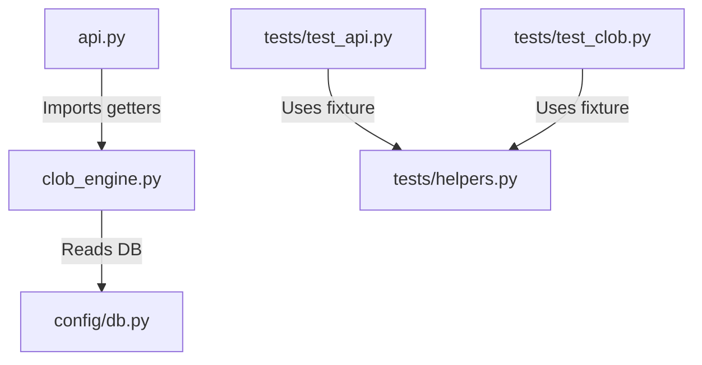

# Code Reuse Review Report

## Executive Summary
This report presents a comprehensive review of code reuse, modularity, and duplicate logic for the prediction market platform, specifically targeting **git commit `c4d046b1d7ce39e08d241c6befeab9208fcb98e4`**. 

The commit successfully integrates a Central Limit Order Book (CLOB) engine and exposes its functionality via FastAPI. However, this review highlights several major areas of concern:
1. **Severe Boilerplate Duplication**: High levels of copy-pasted database connection, querying, and formatting logic across newly added route handlers in `api.py`.
2. **Identical Test Infrastructure Setup/Teardown**: The test suites in `tests/test_api.py` and `tests/test_clob.py` duplicate massive blocks of database seeding, setup, and cleanup transaction logic.
3. **Abuse of Development Database**: Both test suites execute integration tests directly on the development/production database (`bsname.db`), raising data corruption and orphaned test state risks.
4. **Redundant Conditional Logic**: `clob_engine.py` contains structurally identical code blocks for YES and NO outcomes that can be easily generalized.

Below is a detailed breakdown of the findings, accompanied by refactoring plans and reusable patterns to achieve a cleaner, dry, and robust codebase.

---

## 1. Web API Layer: `api.py`

### 1.1 Duplicated SQLite Connection Boilerplate
#### Finding:
In the newly written FastAPI endpoints, SQLite connection boilerplate is hand-rolled and duplicated across four endpoints:
- `GET /users/{user_id}/positions`
- `GET /users/{user_id}/balance`
- `GET /markets/{market_id}/trades`
- `GET /users/{user_id}/orders`

Each endpoint manually establishes a connection, configures `sqlite3.Row`, opens a cursor, executes SQL, fetches rows, closes the connection, and casts the row to `dict`.

#### Example duplication:
```python
db = sqlite3.connect('bsname.db')
db.row_factory = sqlite3.Row
cursor = db.cursor()
# ... SQL execution ...
db.close()
```

#### Recommendation:
Create a centralized database query utility or abstract these direct queries into specialized data fetcher functions inside `clob_engine.py` (matching the pattern used by `get_orderbook`). This keeps the API layer thin and focused purely on HTTP routing, request parsing, and response serialization.

### 1.2 Breaking of the Database Abstraction Barrier
#### Finding:
The REST API's original endpoints delegate operations cleanly:
- `/markets/{market_id}/bets` delegates to `bet_placing.getBets(db, market_id)`.
- `/markets/{market_id}/orders` delegates to `clob_engine.process_order(...)`.

However, the new endpoints bypass helper functions entirely and query the database tables (`user_positions`, `users`, `trades`, `orders`) inline. This mixes raw database schema access directly into the API layer.

#### Recommendation:
Add matching getter helper functions to `clob_engine.py` or a dedicated database service script:
- `get_user_positions(db_path, user_id)`
- `get_user_balance(db_path, user_id)`
- `get_market_trades(db_path, market_id)`
- `get_user_orders(db_path, user_id)`

---

## 2. In-Memory CLOB Matching Engine: `clob_engine.py`

### 2.1 Identical YES/NO Position Logic in `update_position`
#### Finding:
The helper function `update_position(cursor, user_id, market_id, outcome, shares, price)` (lines 413–468) contains two identical, non-contiguous conditional branches for the `'yes'` and `'no'` outcomes. 

The logic to calculate the new average price, prevent negative inventories, and execute the SQL update is copy-pasted, only differing by variable/column names (`shares_yes`/`shares_no` and `avg_price_yes`/`avg_price_no`).

#### Current Duplicated Logic:
```python
if outcome == 'yes':
    new_shares_yes = curr_shares_yes + shares
    if new_shares_yes < 0:
        new_shares_yes = 0
    if shares > 0 and (curr_shares_yes + shares) > 0:
        new_avg_yes = ((curr_shares_yes * avg_yes) + (shares * price)) / (curr_shares_yes + shares)
    else:
        new_avg_yes = avg_yes
    cursor.execute("""
        UPDATE user_positions SET shares_yes = ?, avg_price_yes = ?, updated_at = CURRENT_TIMESTAMP
        WHERE user_id = ? AND market_id = ?;
    """, (new_shares_yes, new_avg_yes, user_id, market_id))
else:
    # Identical copy-paste using shares_no and avg_price_no variables...
```

#### Refactored Dry Logic:
We can reduce this duplication by dynamically setting the target columns and existing variables based on the `outcome`:

```python
col_shares = "shares_yes" if outcome == 'yes' else "shares_no"
col_avg = "avg_price_yes" if outcome == 'yes' else "avg_price_no"
curr_shares = curr_shares_yes if outcome == 'yes' else curr_shares_no
curr_avg = avg_yes if outcome == 'yes' else avg_no

new_shares = max(0, curr_shares + shares)
if shares > 0 and (curr_shares + shares) > 0:
    new_avg = ((curr_shares * curr_avg) + (shares * price)) / (curr_shares + shares)
else:
    new_avg = curr_avg

cursor.execute(f"""
    UPDATE user_positions 
    SET {col_shares} = ?, {col_avg} = ?, updated_at = CURRENT_TIMESTAMP
    WHERE user_id = ? AND market_id = ?;
""", (new_shares, new_avg, user_id, market_id))
```

> [!TIP]
> This simple refactoring reduces the function by ~25 lines while improving maintainability, ensuring that any future average price formula modifications only need to be applied in a single place.

### 2.2 Hardcoded Database Filenames
#### Finding:
The filename `'bsname.db'` is hardcoded as a literal string in many places in `api.py` and is set as a default parameter in all engine and test suite functions. 

This leads to tight coupling, making it extremely difficult to switch to a separate testing database or configure the application database dynamically via environment variables.

---

## 3. Integration Test Suites: `tests/`

### 3.1 100% Duplicate Test Environment Setups & Teardowns
#### Finding:
The test files `tests/test_api.py` and `tests/test_clob.py` duplicate massive chunks of infrastructure code:
- **Temporary Seeding**: Inserting random test user accounts with a `$1000.00` balance.
- **Market Creation**: Inserting a mock market of type `clob` with custom start, end, and resolution timestamps.
- **Teardown Transaction**: A `finally:` block that deletes all transient rows from `trades`, `orders`, `user_positions`, `markets`, and `users` tables, followed by closing the database connection.

This duplication spans nearly 40 lines of boilerplate SQL in each file and must be synchronized manually if the market or user schema evolves.

#### Recommendation:
Define a single shared module or class (e.g. `tests/conftest.py` if using `pytest`, or a simple `tests/helpers.py`) with setup and cleanup functions:

```python
# Proposed tests/helpers.py
def setup_test_environment(cursor):
    user_a_id = str(uuid.uuid4())
    user_b_id = str(uuid.uuid4())
    market_id = str(uuid.uuid4())
    
    # Run insert SQL here...
    return user_a_id, user_b_id, market_id

def teardown_test_environment(cursor, user_a_id, user_b_id, market_id):
    # Run cleanup SQL here...
```

### 3.2 High-Risk Direct Database Usage
#### Finding:
Both tests operate on `bsname.db`, which is the primary SQLite database for local application execution. If a test fails in a way that bypasses the `finally:` block (e.g., keyboard interrupts, syntax errors in teardown, hard exit), it permanently litters the development database with orphaned mock objects.

> [!WARNING]
> Running tests on a live development database is a critical code smell. An accidental execution can mutate active data, and concurrent test runs will conflict on primary key unique constraints.

#### Recommendation:
Tests should leverage a separate, temporary sqlite file (e.g. `test_bsname.db`) or operate entirely in-memory using sqlite's `:memory:` feature by running the schema creation migrations first.

### 3.3 Manual Python Path Hack Duplication
#### Finding:
Both `tests/test_api.py` and `tests/test_clob.py` begin with:
```python
import sys
import os
sys.path.insert(0, os.path.abspath(os.path.join(os.path.dirname(__file__), '..')))
```
While functional, repeating this path resolution script in every single test module highlights a lack of a unified test harness execution strategy. It should instead be handled by standard test configuration or wrapper scripts.

---

## Code Reuse Action Plan & Refactoring Mockup

To eliminate all duplication and improve modularity, we propose implementing a simple refactoring plan described by the file tree below:



### Refactoring Step 1: Database Getter Utility in `clob_engine.py`
Add these helper functions to `clob_engine.py` to keep database operations encapsulated:

```python
def get_user_positions(db_path: str, user_id: str) -> List[dict]:
    conn = sqlite3.connect(db_path)
    conn.row_factory = sqlite3.Row
    cursor = conn.cursor()
    cursor.execute("""
        SELECT market_id, shares_yes, shares_no, avg_price_yes, avg_price_no, updated_at
        FROM user_positions WHERE user_id = ?;
    """, (user_id,))
    rows = cursor.fetchall()
    conn.close()
    return [dict(row) for row in rows]

def get_user_balance(db_path: str, user_id: str) -> Optional[float]:
    conn = sqlite3.connect(db_path)
    conn.row_factory = sqlite3.Row
    cursor = conn.cursor()
    cursor.execute("SELECT balance FROM users WHERE id = ?;", (user_id,))
    row = cursor.fetchone()
    conn.close()
    return row["balance"] if row else None
```

### Refactoring Step 2: Clean API Route Handlers in `api.py`
With getter functions in place, the route handlers in `api.py` become extremely concise and readable:

```diff
 @app.get("/users/{user_id}/positions")
 def read_user_positions(user_id: str):
     """
     Retrieves all open share positions (YES/NO shares, average prices) for a user.
     """
-    db = sqlite3.connect('bsname.db')
-    db.row_factory = sqlite3.Row
-    cursor = db.cursor()
-    cursor.execute("""
-        SELECT market_id, shares_yes, shares_no, avg_price_yes, avg_price_no, updated_at
-        FROM user_positions
-        WHERE user_id = ?;
-    """, (user_id,))
-    rows = cursor.fetchall()
-    db.close()
-    return {"user_id": user_id, "positions": [dict(row) for row in rows]}
+    positions = clob_engine.get_user_positions('bsname.db', user_id)
+    return {"user_id": user_id, "positions": positions}
```
